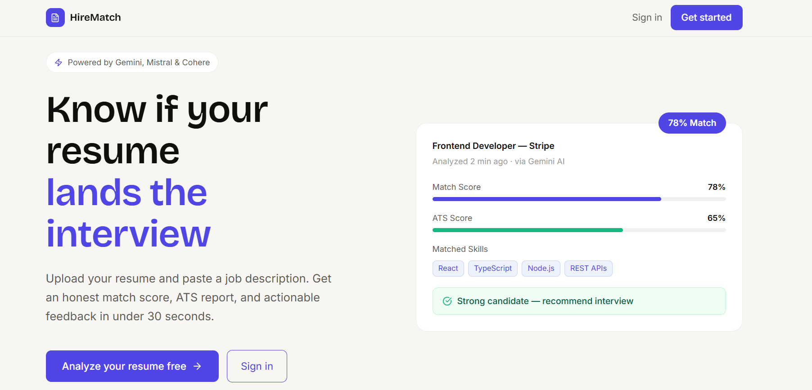
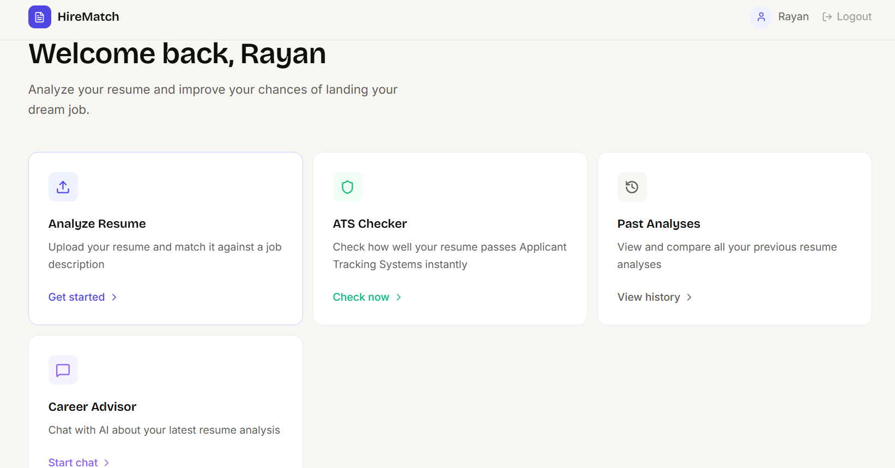
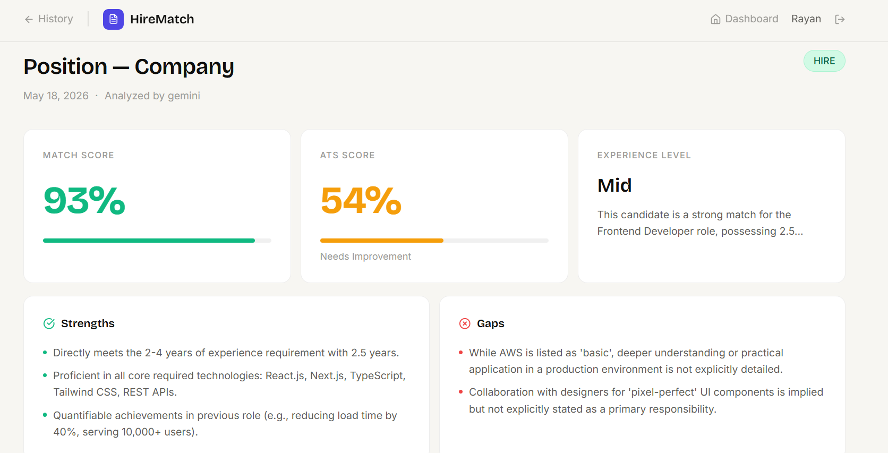

# HireMatch — AI-Powered Resume Analyzer

<div align="center">

**Know if your resume lands the interview — before you apply.**

[](https://hirematch-app.vercel.app)
[](https://github.com/rishikesh-1113/HireMatch)
[](https://nextjs.org)
[](https://nodejs.org)
[](https://mongodb.com)

</div>

---

## What is HireMatch?
## Screenshots

<div align="center">

### Landing Page



### Dashboard



### Analysis Results



</div>

HireMatch is a production-ready, full-stack SaaS application that helps job seekers understand exactly how their resume performs against a job description — before they hit send.

Upload your PDF resume, paste a job description, and get back an honest AI-powered match score, ATS compatibility report, skill gap analysis, and personalized recommendations in under 30 seconds.

**Live at:** [hirematch-taupe.vercel.app](https://hirematch-taupe.vercel.app)

---

## Features

### AI Match Analysis
Compare your resume against any job description using a multi-provider AI engine. Get a realistic match score, identified strengths, skill gaps, and specific recommendations — not generic advice.

### ATS Compatibility Checker
75% of resumes are rejected before a human ever sees them. HireMatch simulates real ATS behavior using a hybrid rule-based and AI approach, detecting formatting issues, missing contact info, keyword gaps, and more.

### Multi-Provider AI with Failover
Powered by 4 AI providers — Gemini, Mistral, Cohere, and OpenRouter — with automatic failover. If one provider hits a rate limit or goes down, the system seamlessly switches to the next. Users never experience downtime.

### AI Career Advisor Chat
After analysis, chat with an AI advisor that knows your specific results. Ask about skill gaps, interview prep, or resume improvements — and get answers grounded in your actual data, not generic career advice.

### Analysis History
Every analysis is saved. Track how your resume improves across different roles and iterations over time.

---

## Tech Stack

| Layer | Technologies |
|---|---|
| **Frontend** | Next.js 16, TypeScript, Tailwind CSS |
| **Backend** | Node.js, Express.js |
| **Database** | MongoDB Atlas, Mongoose |
| **Authentication** | JWT, bcrypt |
| **AI Providers** | Gemini, Mistral, Cohere, OpenRouter |
| **File Handling** | Multer, pdf-parse |
| **Deployment** | Vercel (frontend), Render (backend) |

---

## Architecture

```
User (Browser)
      ↕  HTTP
Frontend — Next.js 16 (Vercel)
      ↕  REST API
Backend — Express.js (Render)
      ↕            ↕
MongoDB Atlas    AI Providers
                 Gemini → Mistral → Cohere → OpenRouter
```

### AI Failover System
```
Request comes in
      ↓
Try Mistral (primary — best quality)
      ↓ if fails
Try Gemini (fast fallback)
      ↓ if fails
Try Cohere (third option)
      ↓ if fails
Try OpenRouter (last resort)
```

### ATS Hybrid Checker
```
PDF uploaded
      ↓
Technical rule checks (instant)
→ Email, phone, sections, dates, action verbs, special chars
      ↓
AI contextual analysis (parallel)
→ Specific issues referencing actual resume content
      ↓
Merge + deduplicate results
→ Apply hard scoring caps for critical failures
→ Return realistic score with actionable fixes
```

---

## API Endpoints

| Method | Endpoint | Description | Auth |
|---|---|---|---|
| POST | `/api/auth/register` | Create account | Public |
| POST | `/api/auth/login` | Login | Public |
| GET | `/api/auth/me` | Get current user | Private |
| POST | `/api/analysis/analyze` | Upload resume + analyze | Private |
| GET | `/api/analysis/history` | Get all past analyses | Private |
| GET | `/api/analysis/:id` | Get specific analysis | Private |
| DELETE | `/api/analysis/:id` | Delete analysis | Private |
| POST | `/api/ats/check` | Standalone ATS check | Private |
| GET | `/api/ats/tips` | Get ATS optimization tips | Private |
| POST | `/api/chat/analysis/:id` | Chat about an analysis | Private |
| POST | `/api/chat/general` | General career advice chat | Private |

---

## Running Locally

### Prerequisites
- Node.js 22 LTS
- MongoDB Atlas account (free tier)
- API keys: Gemini, Mistral, Cohere, OpenRouter

### Backend Setup

```bash
cd backend
npm install
cp .env.example .env
# Add your API keys to .env
npm run dev
```

Backend runs on `http://localhost:12001`

### Frontend Setup

```bash
cd frontend
npm install
# Create .env.local with:
# NEXT_PUBLIC_API_URL=http://localhost:12001
npm run dev
```

Frontend runs on `http://localhost:3000`

---

## Environment Variables

### Backend `.env`

```
PORT=12001
NODE_ENV=development

# Database
MONGO_URI=your_mongodb_connection_string

# Auth
JWT_SECRET=your_jwt_secret_minimum_32_characters

# AI Providers (priority order)
GEMINI_API_KEY=your_gemini_api_key
MISTRAL_API_KEY=your_mistral_api_key
COHERE_API_KEY=your_cohere_api_key
OPEN_ROUTER_API_KEY=your_openrouter_api_key
```

### Frontend `.env.local`

```
NEXT_PUBLIC_API_URL=http://localhost:12001
```

---

## Key Technical Decisions

**Why 4 AI providers?**
AI APIs fail — rate limits, downtime, timeouts. With 4 providers in priority order, we achieve near-100% uptime for analysis. In development, Gemini hit free-tier limits mid-session. The system automatically switched to Mistral. The user never knew.

**Why hybrid ATS checking?**
Pure rule-based checking is fast and reliable but misses context. Pure AI is intelligent but inconsistent. The hybrid approach uses rules as a guaranteed baseline and AI for contextual, content-specific insights. Both run in parallel — results are merged and deduplicated.

**Why Next.js over plain React?**
File-based routing, server-side rendering for SEO, better performance, and Vercel deployment is seamless. For a SaaS product that needs good landing page SEO, Next.js was the right call.

**Why MongoDB over SQL?**
Resume analysis data is inherently nested — skills arrays, feedback objects, scoring breakdowns, ATS checks. MongoDB's document model fits this naturally without complex join tables.

---

## What I Learned Building This

- Architecting a production full-stack application from zero
- Integrating multiple third-party AI APIs with intelligent failover
- Building JWT authentication with bcrypt from scratch
- Handling file uploads, PDF parsing, and binary data in Node.js
- Designing database schemas for nested, flexible data
- Deploying a full-stack app across two separate services (Render + Vercel)
- Debugging real production issues — rate limits, CORS, token expiry, memory crashes

---

## Author

**Rishikesh**
- GitHub: [@rishikesh-1113](https://github.com/rishikesh-1113)

---

## License

MIT License — feel free to use this project as reference or inspiration.
